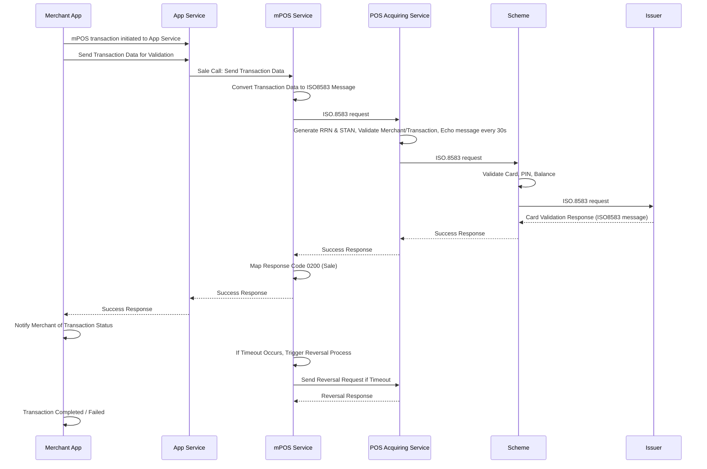

# mPOS Payment

This is a form of merchant-initiated payment where the merchant can initiate an mPOS payment from the application.

## Functional Flow

| Requester | Action(s) / Process Description |
|---|---|
| Merchant App | Merchant initiates the mPOS transaction to the App Service. |
| App Service | Validates merchant info. A Sale API call is made, sending transaction data to mPOS Service. |
| mPOS Service | Converts transaction data into an ISO8583 message. Sends ISO8583 message to POS Acquiring Service. |
| POS Acquiring Service | Generates RRN and STAN. Validates the merchant and transaction request. Sends an echo message to the scheme every 30 seconds to maintain connectivity. Sends ISO8583 message to the relevant scheme. |
| Scheme | Validates Card, PIN, and Balance. Sends ISO8583 message to the Issuer for card verification. |
| Issuer | Validates the card. Sends response back to the scheme with an ISO8583 message. |
| Scheme | Responds back to POS Acquiring Service. |
| POS Acquiring Service | Sends response back to mPOS Service. The response includes ISO8583 field 39 with the response code for transaction status. |
| mPOS Service | Sends response back to App Service with the ISO8583 response code. Based on the response code, the transaction is either initiated or failed. |
| App Service | Sends ISO8583 response code back to Merchant App. |
| Merchant App | Notifies the merchant about the transaction status (successful or failed). |

## Process Flow — Sequence Diagram

See also: [SoftPOS Payment](./softpos), [Card Acquiring Introduction](../Intro).
