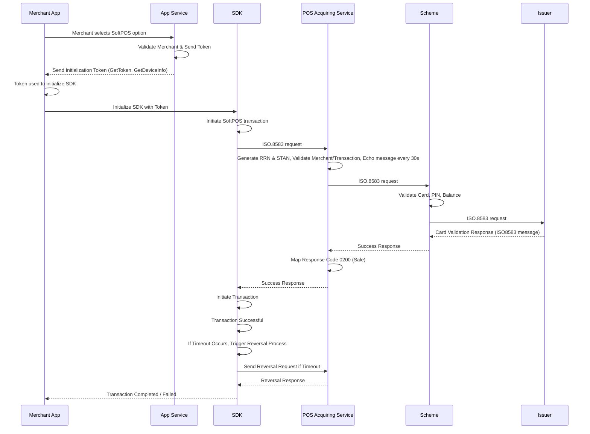

# SoftPOS Payment

This is a form of merchant-initiated payment where the merchant can initiate a SoftPOS payment from the application.

## Functional Flow

| Requester | Action(s) / Process Description |
|---|---|
| Merchant App | Merchant selects the SoftPOS option. |
| App Service | Merchant is validated. SDK initialization token is sent to the merchant app. `GetToken` (session token) and `GetDeviceInfo` are called to retrieve device information. |
| Merchant App | The token is used to initialize the SDK. Merchant app initializes the SDK with the provided token. |
| SDK | SoftPOS transaction is initiated to SDK. SDK validates the request (terminal) and processes it. SDK receives the request for SoftPOS and sends an ISO8583 message to POS Acquiring Services. |
| POS Acquiring Service | Generates RRN and STAN. Validates the merchant and transaction request. Sends an echo message to the scheme every 30 seconds to maintain connectivity. Sends ISO8583 message to the relevant scheme. |
| Scheme | Validates the card, PIN, and balance. Sends ISO8583 message to the issuer for card verification. |
| Issuer | Responds back to the scheme with the ISO8583 message. |
| Scheme | Responds back to POS Acquiring Service. |
| POS Acquiring Service | Sends POS acquiring response back to SDK. POS acquiring responds with ISO8583 field 39 containing the response code for transaction status. |
| SDK | Sends response back to the merchant app with the response code. Based on the response code, the transaction is either initiated or fails. |
| Merchant App | Notifies the merchant of the transaction status. |
| SDK | If timeout occurs, the reversal process is triggered. |

## Process Flow — Sequence Diagram

See also: [mPOS Payment](./mpos), [Card Acquiring Introduction](../Intro).
