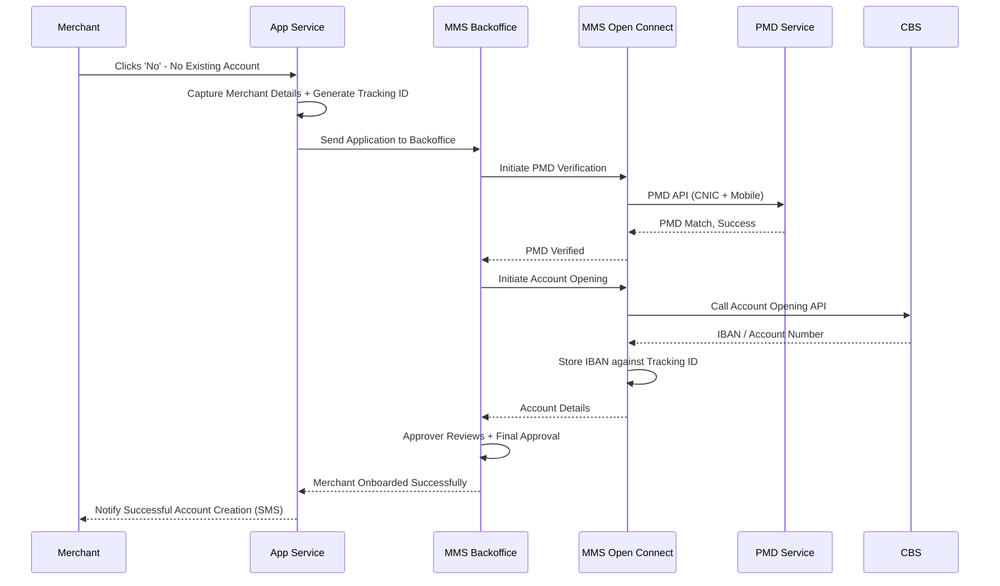
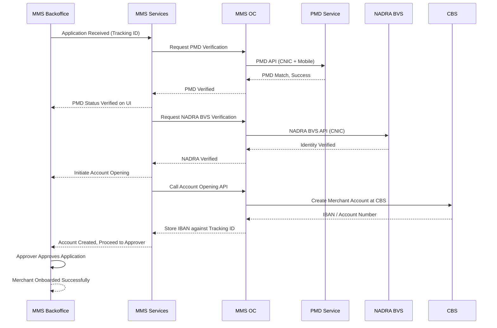

# New-to-Bank (NTB)

For merchants who do not hold an account with the Acquiring Bank. The account is created during onboarding via PMD and NADRA BVS verification.

## Account Linking — Positive Flow

| Requester | Action(s) / Process Description |
|---|---|
| Merchant | Logs into app. Clicks on financial functionality. Popup appears: 'Do you have an existing [Bank Name] account?' Clicks 'No'. |
| App Service | Initiates NTB onboarding flow. Captures merchant details (Name, CNIC, Mobile, Address). Generates Tracking ID. Sends application to Backoffice. |
| MMS Backoffice (Maker) | Receives application. Initiates PMD Verification. |
| MMS Open Connect | Sends PMD API request to validate mobile number against CNIC. |
| PMD Service | Validates CNIC vs Mobile Number. Returns match result. |
| MMS Backoffice | PMD status shown as Verified. Proceeds to Account Opening. |
| MMS Open Connect | Calls Account Opening API for merchant account creation at CBS. |
| CBS | Creates merchant account. Returns IBAN/Account Number to MMS OC. |
| MMS Open Connect | Stores IBAN against Tracking ID. Returns account details to Backoffice. |
| MMS Backoffice (Approver) | Reviews application. Final approval. Merchant onboarded with new account. |
| App Service | Notifies merchant of successful account creation via SMS. |

### Sequence Diagram — NTB Account Linking (Positive)

## Negative Cases

### PMD Verification Failed

| Requester | Action(s) / Process Description |
|---|---|
| PMD Service | Mobile number does not match CNIC. Returns mismatch. Application cannot proceed. |

### Account Creation Failed

| Requester | Action(s) / Process Description |
|---|---|
| CBS | Account creation fails. Returns error. Application status shown as 'Account Not Created / IBAN Not Assigned'. |

## Backoffice Approval of Merchant (NTB)

After an NTB merchant submits registration, the application is processed through the Backoffice Maker-Checker-Approver workflow, including third-party verifications.

| Requester | Action(s) / Process Description |
|---|---|
| MMS Backoffice | Application received with Tracking ID. Maker processes the application. Initiates PMD Verification. |
| MMS Open Connect | Calls PMD Service for mobile number verification. |
| PMD Service | Validates and returns match result. |
| MMS Backoffice | PMD status shown as Verified. Initiates NADRA BVS Verification. |
| MMS Open Connect | Calls NADRA BVS API for identity verification. |
| NADRA BVS | Verifies identity. Returns success. |
| MMS Backoffice | NADRA status shown as Verified. Proceeds to Account Opening. |
| MMS Open Connect | Calls Bank Account Opening API. |
| CBS | Creates account. Returns IBAN/Account Number. |
| MMS Backoffice | Account creation status shown. Forwards to final Approver. |
| Approver | Reviews complete application. Approves. Merchant is fully onboarded with bank account. |

### Sequence Diagram — Backoffice Approval (NTB)

### Negative Cases

| Case | Requester | Action(s) / Process Description |
|---|---|---|
| PMD Verification Failed | MMS Backoffice | PMD mismatch. Application cannot proceed. Status shown as 'PMD Not Verified'. |
| NADRA BVS Failed | MMS Backoffice | NADRA verification failed. Application cannot proceed. |

See also: [ETB – Existing to Bank](../../MMS/Merchant-profile-Management/kyc), [Merchant KYC](../../MMS/Merchant-profile-Management/kyc), [Merchant Approval from Backoffice](./Merchant-approval).
