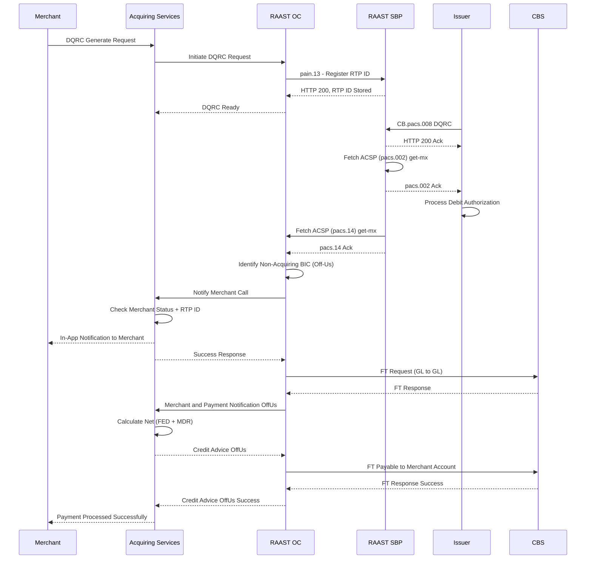
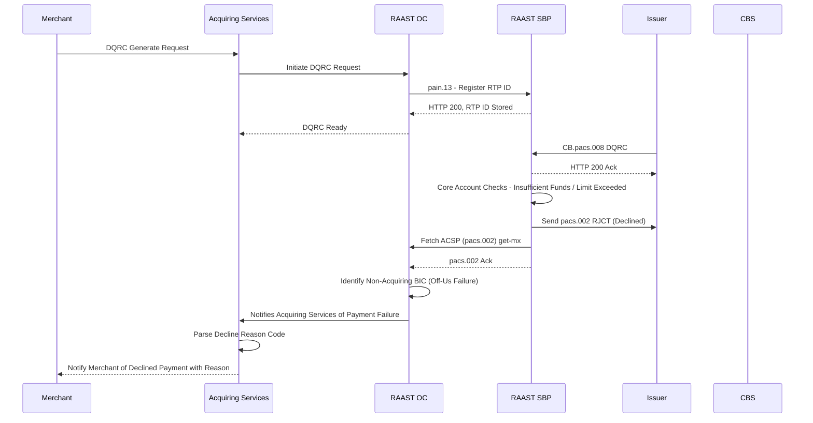

# Dynamic QRC (DQRC) — Off-Us Transaction

Customer is from a different bank. Merchant is at the Acquiring Bank.

## Positive Flow

| Requester | Action(s) / Process Description |
|---|---|
| Merchant | Selects DQRC generate option. Request for DQRC generated. |
| Acquiring Services | Receives request. Initiates DQRC request to RAAST OC. |
| RAAST OC | Validates. Creates `pain.13` with unique RTP ID. Sends to RAAST SBP. |
| RAAST SBP | Validates. Checks RTP ID uniqueness. Stores RTP ID. Returns HTTP 200. |
| RAAST OC | Receives acknowledgement. Shares to Acquiring Services. DQRC ready. |
| Issuer (Customer) | Scans DQRC. Validates QR string. Calls payment request to RAAST SBP (`CB.pacs.008 DQRC`). |
| RAAST SBP | Receives `pacs.008`. Sends acknowledgement HTTP 200 to Issuer. Fetches ACSP (`pacs.002`) get-mx. Shares `pacs.002` acknowledgement to Issuer. |
| Issuer | Receives `pacs.008` and `pacs.002` acknowledgements. Processes debit authorization. |
| RAAST SBP | Fetches ACSP (`pacs.14`) get-mx from RAAST OC. Shares acknowledgement of `pacs.14` to RAAST OC. |
| RAAST OC | Identifies sender BIC as non-Acquiring Bank (Off-Us). Initiates Notify Merchant call to Acquiring Services. |
| Acquiring Services | Receives notification. Notifies merchant. Checks Merchant Status and RTP ID. |
| Merchant | Notified via in-app notification. |
| Acquiring Services | Shares success response to RAAST OC. |
| RAAST OC | Fetches `CB.pacs.008` get-mx from RAAST SBP. Initiates Fund Transfer to CBS (GL to GL). |
| CBS | Debits RAAST GL Account. Credits Merchant Payable GL Account. Returns FT response. |
| RAAST OC | Initiates Merchant and Payment Notification OffUs to Acquiring Services. |
| Acquiring Services | Receives notification. Shares acknowledgement. Calculates Net Amount (FED + MDR). Initiates Credit Advice OffUs to RAAST OC. |
| RAAST OC | Sends Fund Transfer request to CBS. |
| CBS | Debits Merchant Payable GL Account. Credits Merchant Account (net amount). Returns response. |
| RAAST OC | Sends Credit Advice OffUs success to Acquiring Services. |
| Acquiring Services | Sends payment success notification to merchant. |

### Sequence Diagram — DQRC Off-Us (Positive)

## Negative Cases

### Payment Declined (Off-Us)

| Requester | Action(s) / Process Description |
|---|---|
| RAAST SBP | Issuer returns decline (insufficient funds / limit exceeded). |
| RAAST OC | Notifies Acquiring Services of payment failure. |
| Acquiring Services | Notifies merchant of declined payment with reason. |

### Sequence Diagram — DQRC Off-Us (Negative)

