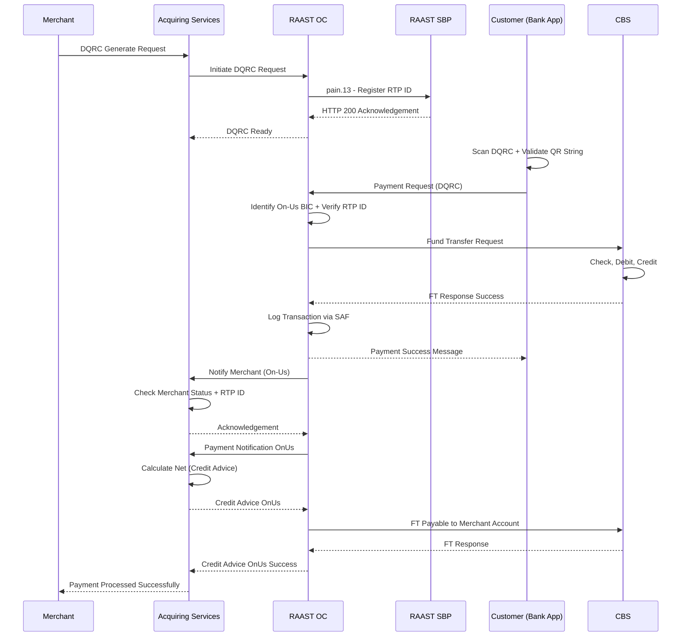
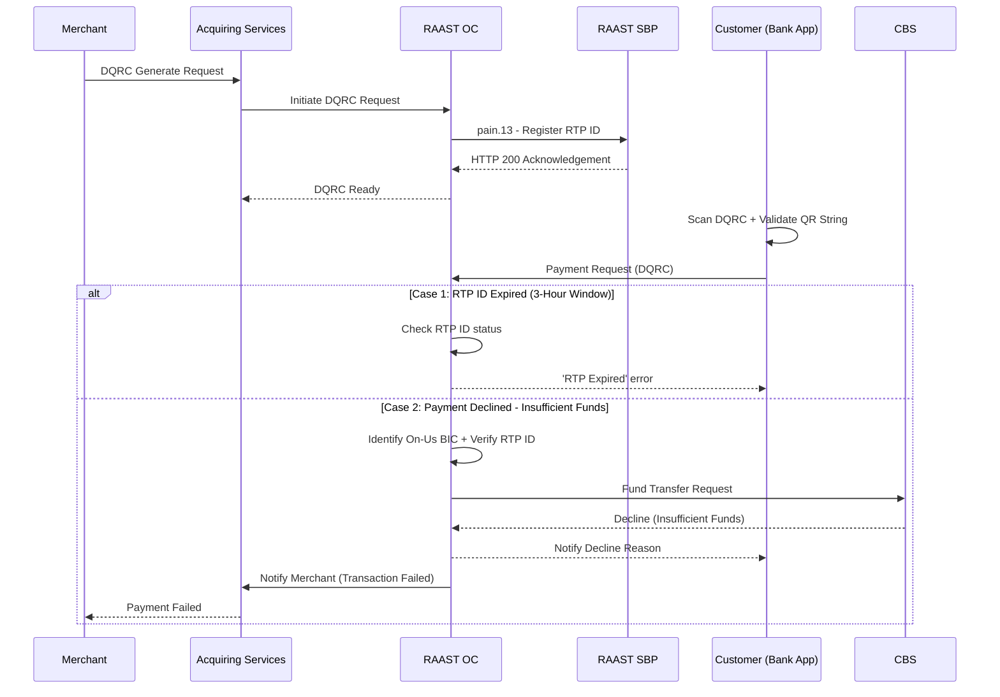

# Dynamic QRC (DQRC) — On-Us Transaction

Dynamic QRC is a merchant-initiated payment.

- Each DQRC is generated per transaction — it is one-time payable only.
- Maximum expiry: 3 hours from generation.
- When generated, DQRC is assigned a unique RTP ID and registered at RAAST SBP via `pain.13`.
- Merchant generates DQRC via Merchant Portal or Merchant App.
- The merchant account always resides with the Acquiring Bank.

Customer and Merchant are both from the same Acquiring Bank.

## Positive Flow

| Requester | Action(s) / Process Description |
|---|---|
| Merchant | Selects DQRC generate option. A request for DQRC is generated. |
| Acquiring Services | Receives DQRC request. Initiates DQRC request to RAAST OC. |
| RAAST OC | Validates request. Creates `pain.13` with unique RTP ID. Sends `pain.13` to RAAST SBP. |
| RAAST SBP | Validates request. Checks RTP ID uniqueness. Stores RTP ID. Returns HTTP 200 acknowledgement to RAAST OC. |
| RAAST OC | Receives acknowledgement. Shares acknowledgement to Acquiring Services. DQRC is ready for scanning. |
| Acquiring Bank App (Customer) | Customer scans DQRC. App validates the QR string. Calls payment request to RAAST OC for DQRC. |
| RAAST OC | Receives payment request. Identifies BIC as Acquiring Bank (On-Us). Checks RTP ID against DQRC. Initiates FT call to CBS. |
| CBS | Checks customer limits and status. Debits customer account. Credits Merchant Payable GL Account. Returns FT response to RAAST OC. |
| RAAST OC | Receives FT response. On success, logs transaction via SAF. Sends success message to Acquiring Bank App. Calls Notify Merchant to Acquiring Services. |
| Acquiring Bank App | Receives payment success message. |
| Acquiring Services | Receives Notify Merchant request. Notifies merchant. Checks Merchant Status and RTP ID. Sends acknowledgement to RAAST OC. |
| RAAST OC | Receives acknowledgement. Shares Payment Notification OnUs to Acquiring Services. |
| Acquiring Services | Receives Payment Notification OnUs. Calculates Net Payment (Credit Advice OnUs) — deducts MDR + FED. Initiates Credit Advice OnUs to RAAST OC. |
| RAAST OC | Sends Fund Transfer Request to CBS. |
| CBS | Debits Merchant Payable GL Account. Credits Merchant Account. Returns FT response to RAAST OC. |
| RAAST OC | Receives FT response. Sends Credit Advice OnUs success to Acquiring Services. |
| Acquiring Services | Notifies merchant: Payment Processed Successfully. |

### Sequence Diagram — DQRC On-Us (Positive)

## Negative Cases

### RTP ID Expired (3-hour expiry)

| Requester | Action(s) / Process Description |
|---|---|
| RAAST OC | Checks RTP ID. RTP ID has expired. Returns 'RTP Expired' error to customer app. |

### Payment Declined — Insufficient Funds

| Requester | Action(s) / Process Description |
|---|---|
| CBS | Customer balance insufficient. Returns decline. RAAST OC notifies customer app and merchant. |

### Sequence Diagram — DQRC On-Us (Negative)

