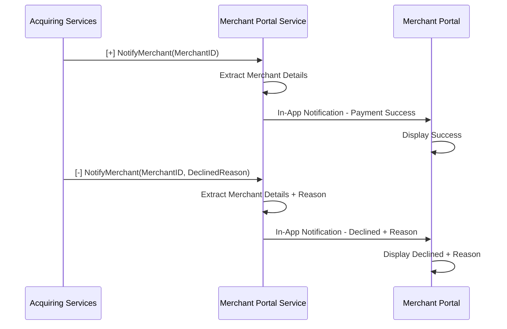

# Notify Merchant and Payment

The Notify Merchant API is called by Acquiring Services via callback URL to inform the merchant that an RTP has been accepted or a payment has been processed. This applies to both On-Us and Off-Us flows, and both Merchant and Merchant Aggregator.

## Positive Flow

| Requester | Action(s) / Process Description |
|---|---|
| Acquiring Services (RAAST) | Payment transaction is successfully processed. |
| Merchant Portal Services | Acquiring Services sends `NotifyMerchant` request with MerchantID. Portal Services extracts merchant details using MerchantID. Sends In-App Notification to Merchant Portal. |
| Merchant Portal | Displays transaction status as successful on screen. |

## Negative Flow – Payment Declined

| Requester | Action(s) / Process Description |
|---|---|
| Acquiring Services (RAAST) | Payment is declined (insufficient funds, account restrictions, etc.). Sends `NotifyMerchant` request with MerchantID and DeclinedReason. |
| Merchant Portal Services | Extracts merchant details using MerchantID. Sends In-App Notification to Merchant Portal with declined transaction details and reason. |
| Merchant Portal | Displays transaction status as Declined with reason (e.g., 'Insufficient Funds'). |

## Sequence Diagram — Notify Merchant (Positive + Negative)

