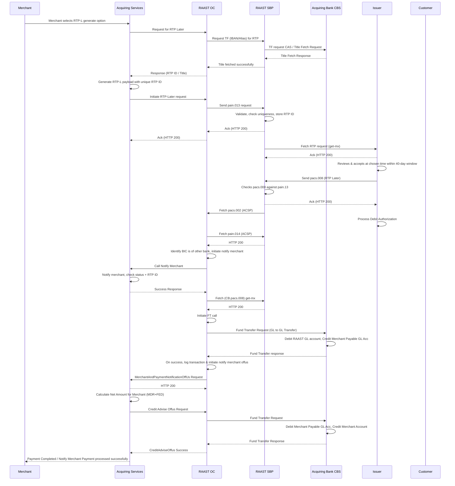
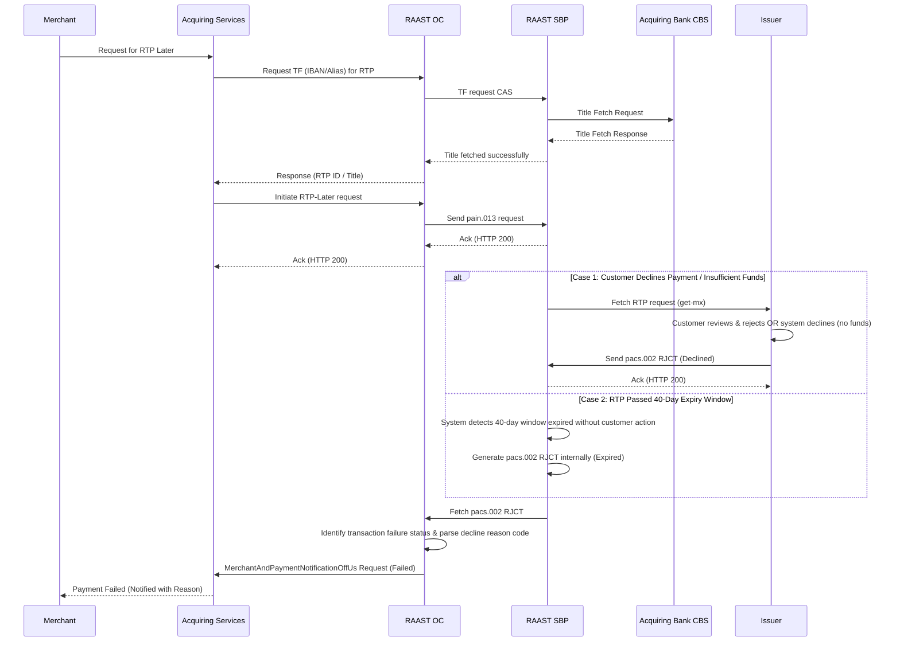

# Request to Pay – Later (RTP Later) — Off-Us Transaction

## Positive Flow

| Requester | Action(s) / Process Description |
|---|---|
| Merchant | Selects RTP Later. |
| Acquiring Services | Initiates Title Fetch to RAAST OC. |
| RAAST OC | Sends `TF-CAS` to RAAST SBP. |
| RAAST SBP | Fetches from Issuer CBS. Returns title. |
| RAAST OC | Returns RTP ID and Title to Acquiring Services. |
| Acquiring Services | Generates RTP Later payload. Initiates to RAAST OC. |
| RAAST OC | Sends `pain.13` to RAAST SBP. |
| RAAST SBP | Validates. Stores RTP ID. Returns acknowledgement. |
| Issuer | Fetches RTP Later request get-mx. Presents to customer. |
| Customer | Reviews. Accepts. At chosen time within 40-day window: initiates payment. Sends `pacs.008`. |
| RAAST SBP | Processes `pacs.008`. Sends `pacs.14` to RAAST OC. |
| RAAST OC | Initiates Fund Transfer to CBS. |
| CBS | Debits RAAST GL. Credits Merchant Payable GL. |
| RAAST OC | Merchant and Payment Notification OffUs to Acquiring Services. |
| Acquiring Services | Calculates net. Credit Advice OffUs. CBS debits Payable GL. Credits Merchant Account. |
| Acquiring Services | Notifies merchant: Payment Successful. |

### Sequence Diagram — RTP Later Off-Us (Positive)

## Negative Cases

### RTP Expired / Payment Declined

| Requester | Action(s) / Process Description |
|---|---|
| RAAST SBP / Issuer | RTP expired or payment declined. `pacs.002 RJCT`. Merchant notified with reason. |

### Sequence Diagram — RTP Later Off-Us (Negative)

