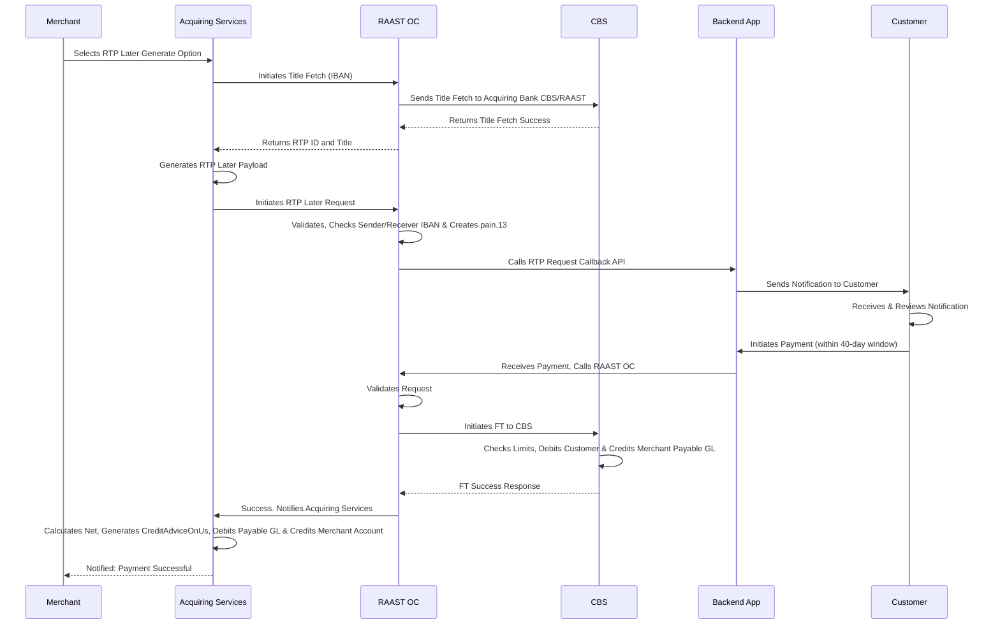
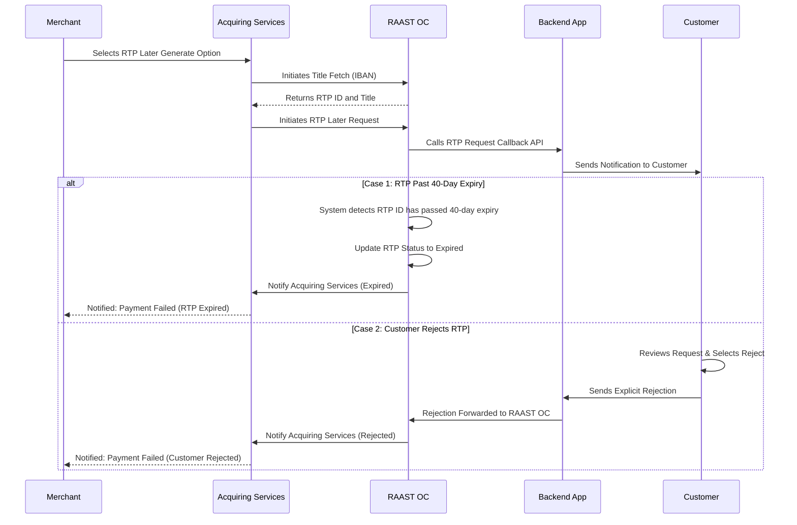

# Request to Pay – Later (RTP Later) — On-Us Transaction

RTP Later is a merchant-initiated deferred payment request.

- Expects deferred payment from the customer — not immediate.
- Maximum expiry: 40 days from RTP creation.
- Primarily applicable for bulk billing scenarios: schools, utilities, subscription services.
- Flow is identical to RTP Now except the payment is deferred.

## Positive Flow

| Requester | Action(s) / Process Description |
|---|---|
| Merchant | Selects RTP Later generate option. RTP Later request initiated. |
| Acquiring Services | Initiates Title Fetch (IBAN) to RAAST OC. |
| RAAST OC | Sends Title Fetch to Acquiring Bank CBS/RAAST. |
| CBS | Returns Title Fetch success. |
| RAAST OC | Returns RTP ID and Title to Acquiring Services. |
| Acquiring Services | Generates RTP Later payload. Initiates RTP Later request to RAAST OC. |
| RAAST OC | Validates. Checks sender and receiver IBAN. Creates `pain.13`. Calls RTP Request Callback API to Backend App. |
| Backend App | Receives RTP Request. Validates. Sends notification to customer. |
| Customer | Receives notification. Reviews request. Accepts. At chosen time (within 40-day window): authenticates and initiates payment. |
| Backend App | Receives payment. Calls RAAST OC. |
| RAAST OC | Validates. Initiates FT to CBS. |
| CBS | Checks limits. Debits customer. Credits Merchant Payable GL. |
| RAAST OC | Success. Notifies Acquiring Services. |
| Acquiring Services | Calculates net. Credit Advice OnUs. Debits Payable GL. Credits Merchant Account. |
| Merchant | Notified: Payment Successful. |

### Sequence Diagram — RTP Later On-Us (Positive)

## Negative Cases

### RTP Expired (40-Day Window Exceeded)

| Requester | Action(s) / Process Description |
|---|---|
| RAAST OC / RAAST SBP | RTP ID has passed 40-day expiry. RTP status updated to Expired. Merchant notified. |

### Customer Rejects

| Requester | Action(s) / Process Description |
|---|---|
| Backend App | Customer rejects RTP. Rejection forwarded to RAAST OC. Merchant notified. |

### Sequence Diagram — RTP Later On-Us (Negative)

