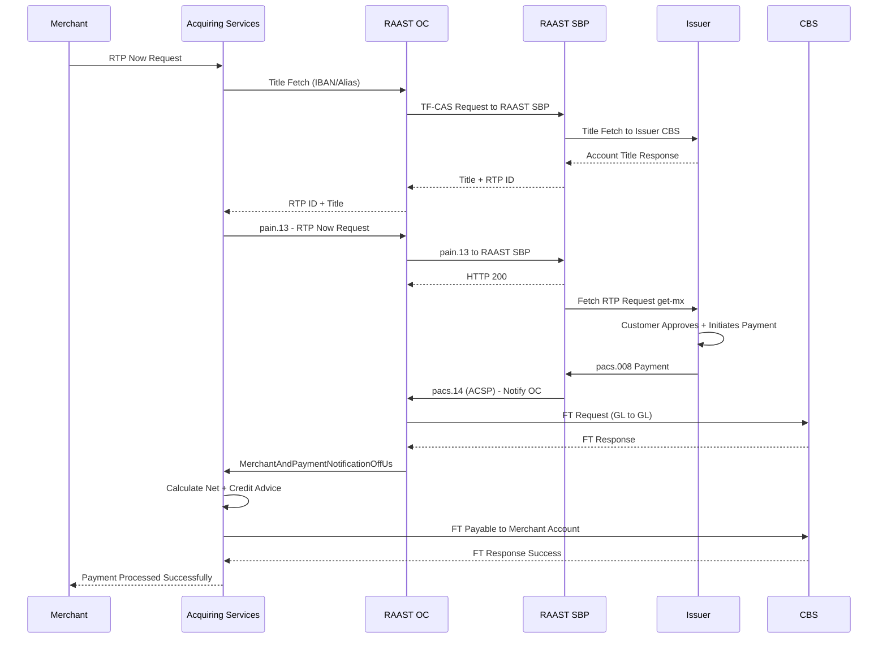
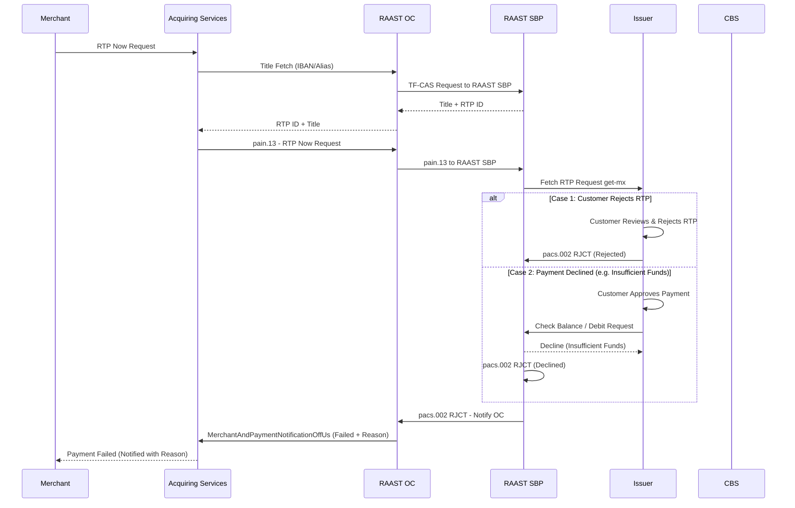

# Request to Pay – Now (RTP Now) — Off-Us Transaction

Customer is from a different bank.

## Positive Flow

| Requester | Action(s) / Process Description |
|---|---|
| Merchant | Selects RTP Now. Requests initiated to Acquiring Services. |
| Acquiring Services | Initiates Title Fetch (IBAN) to RAAST OC. |
| RAAST OC | Sends Title Fetch `TF-CAS` request to RAAST SBP. |
| RAAST SBP | Receives `TF-CAS`. Shares acknowledgement. Sends Title Fetch to Issuer CBS. |
| Issuer CBS | Returns Title Fetch success. |
| RAAST SBP | Returns success to RAAST OC. |
| RAAST OC | Returns RTP ID and Title to Acquiring Services. |
| Acquiring Services | Generates RTP Now payload. Initiates to RAAST OC. |
| RAAST OC | Sends `pain.13` to RAAST SBP. |
| RAAST SBP | Validates. Stores RTP ID. Returns acknowledgement. |
| Issuer | Fetches RTP Now request get-mx from RAAST SBP. Validates. Presents to customer. |
| Customer | Reviews. Approves. Authenticates. Initiates payment. Sends `pacs.008` to RAAST SBP. |
| RAAST SBP | Receives `pacs.008`. Processes. Sends `pacs.14` (ACSP) to RAAST OC. |
| RAAST OC | Receives `pacs.14`. Identifies Off-Us. Initiates Fund Transfer to CBS. |
| CBS | Debits RAAST GL. Credits Merchant Payable GL. |
| RAAST OC | Initiates Merchant and Payment Notification OffUs to Acquiring Services. |
| Acquiring Services | Calculates net. Sends Credit Advice OffUs. |
| CBS | Debits Merchant Payable GL. Credits Merchant Account. |
| Acquiring Services | Notifies merchant: Payment Successful. |

### Sequence Diagram — RTP Now Off-Us (Positive)

## Negative Cases

### Customer Rejects / Payment Declined

| Requester | Action(s) / Process Description |
|---|---|
| Issuer / RAAST SBP | Customer rejects or payment declined (insufficient funds). `pacs.002 RJCT` sent. Merchant notified of failure with reason. |

### Sequence Diagram — RTP Now Off-Us (Negative)

