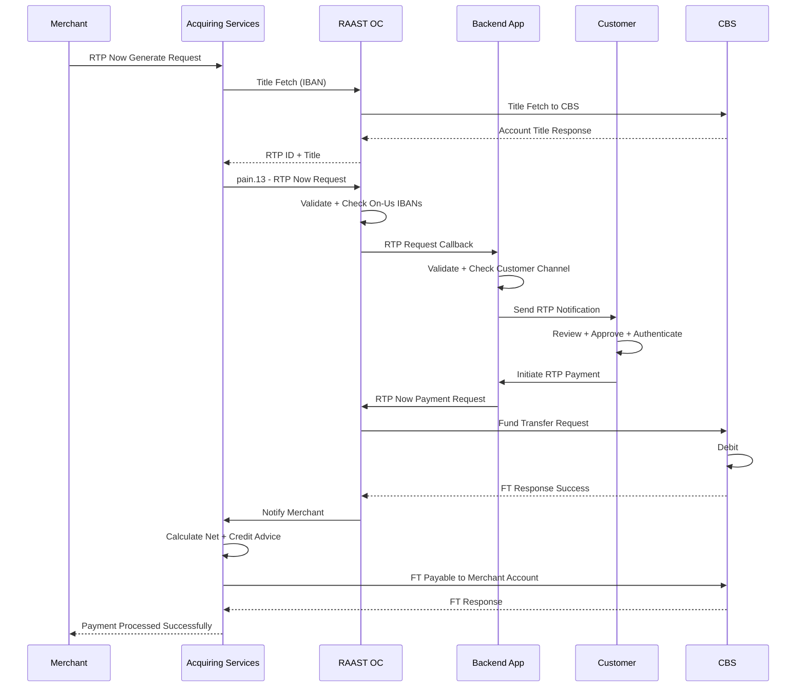
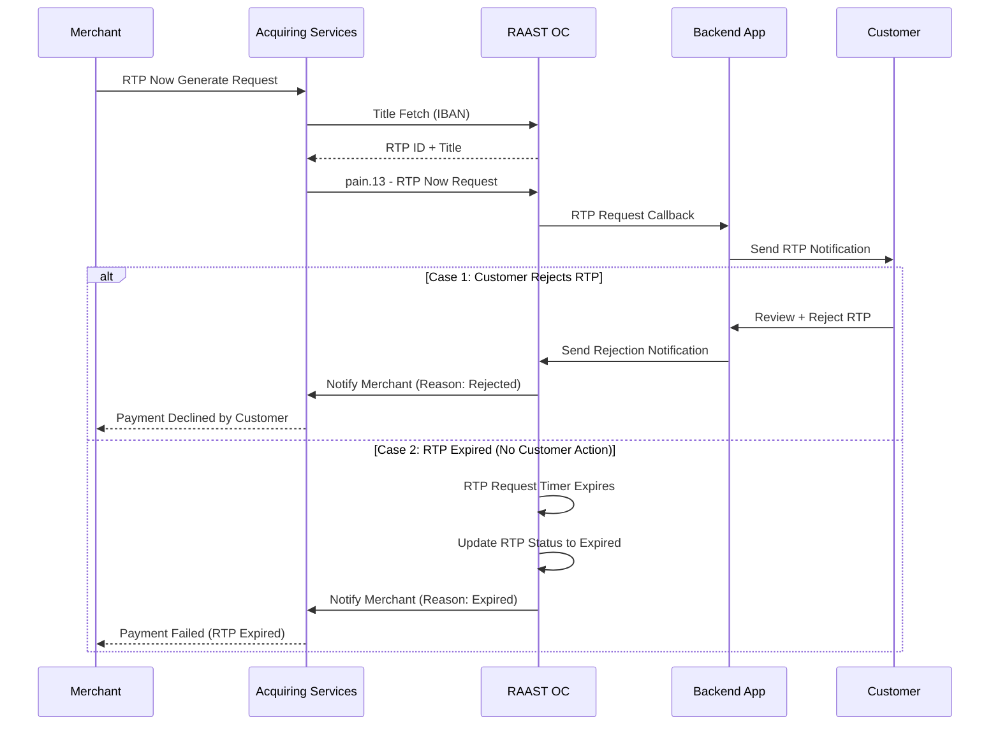

# Request to Pay – Now (RTP Now) — On-Us Transaction

RTP Now is a merchant-initiated payment that expects immediate payment from the customer.

- Merchant initiates the RTP request using customer IBAN or RAAST ID.
- Customer receives an in-app push notification and must authorize payment in real time.
- Uses Title Fetch for IBAN/Alias verification before creating the RTP.

Customer and Merchant are both from the same Acquiring Bank.

## Positive Flow

| Requester | Action(s) / Process Description |
|---|---|
| Merchant | Selects RTP Now generate option. RTP Now request initiated to Acquiring Services. |
| Acquiring Services | Receives request. Initiates Title Fetch (IBAN) request to RAAST OC. |
| RAAST OC | Sends Title Fetch request to Acquiring Bank CBS/RAAST. |
| CBS | Returns success response for Title Fetch. |
| RAAST OC | Validates response. Returns RTP ID and Title to Acquiring Service. |
| Acquiring Services | Receives RTP ID. Generates RTP Now payload with RTP ID. Initiates RTP Now request to RAAST OC. |
| RAAST OC | Receives RTP Now request. Validates. Checks sender and receiver IBAN of Acquiring Bank. Creates `pain.13` with RTP ID. Calls RTP Request Callback API to Backend App. |
| Backend App | Receives RTP Request. Validates. Checks customer digital channel. Sends notification to customer. |
| Customer | Receives RTP Now notification. Reviews request. Approves. Authenticates (PIN/Biometric). Initiates RTP Now payment. |
| Backend App | Receives payment request. Calls RAAST OC with payment. |
| RAAST OC | Validates payment request. Initiates Fund Transfer to CBS. |
| CBS | Checks customer limits and status. Debits customer account. Credits Merchant Payable GL Account. Returns response. |
| RAAST OC | On success, logs via SAF. Notifies Acquiring Services. |
| Acquiring Services | Calculates net amount. Initiates Credit Advice OnUs. Debits Merchant Payable GL. Credits Merchant Account. |
| Merchant | Receives notification of successful payment. |

### Sequence Diagram — RTP Now On-Us (Positive)

## Negative Cases

### Customer Rejects RTP

| Requester | Action(s) / Process Description |
|---|---|
| Backend App / Customer | Customer reviews and rejects RTP. Rejection sent to RAAST OC. Merchant notified of rejection. |

### RTP Expired (Customer does not respond)

| Requester | Action(s) / Process Description |
|---|---|
| RAAST OC | RTP request expires without customer action. RTP status updated to Expired. Merchant notified. |

### Sequence Diagram — RTP Now On-Us (Negative)

