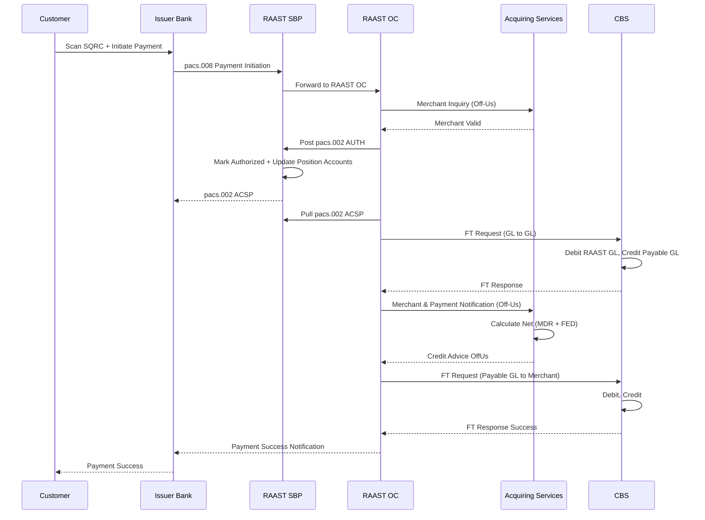
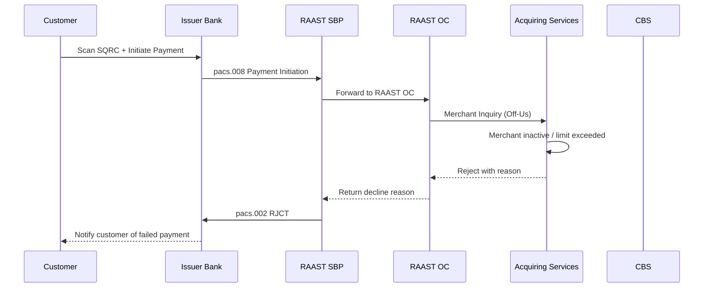

# Static QRC (SQRC) — Off-Us Transaction

This is the flow when the Customer is from a different bank and the Merchant is at the Acquiring Bank.

## Positive Flow

| Requester | Action(s) / Process Description |
|---|---|
| Customer | Scans merchant's QR code using their mobile banking app. Enters amount. Approves transaction. |
| Issuer Bank | Processes payment request. Sends `pacs.008` message to RAAST SBP for payment initiation. |
| RAAST SBP | Validates payment request. Places hold on funds. Forwards to RAAST OC. |
| RAAST OC | Sends Merchant Inquiry (Off-Us) to Acquiring Services to check merchant account status. |
| Acquiring Services (RAAST) | Validates merchant account and status. Responds with success. |
| RAAST OC | Posts `pacs.002 AUTH` to RAAST SBP. |
| RAAST SBP | Marks payment as authorized. Updates position accounts. Generates `pacs.002 ACSP` for participants. |
| RAAST OC | Pulls `pacs.002 ACSP`. Initiates Fund Transfer (GL to GL) to CBS. |
| CBS | Debits RAAST GL Account. Credits Merchant Payable GL Account. Responds to RAAST OC. |
| RAAST OC | On successful payment, initiates Payment Notification (Off-Us) to Acquiring Services. |
| Acquiring Services | Responds with acknowledgement. Calculates fee and net amount (MDR + FED). Sends Credit Advice (Off-Us) to RAAST OC. |
| RAAST OC | Receives Credit Advice. Initiates FT to CBS (STR Fund Transfer Deposits). |
| CBS | Debits Merchant Payable GL Account (less MDR + FED). Credits Merchant Account (net amount). Responds to RAAST OC. |
| RAAST OC | Receives success. Responds to Acquiring Services. |
| Acquiring Services | Notifies merchant of successful payment via in-app notification. |
| Issuer Bank | Informs customer of payment success via their banking app. |

### Sequence Diagram — SQRC Off-Us (Positive)

## Negative Cases

### Payment Declined (Off-Us)

| Requester | Action(s) / Process Description |
|---|---|
| Acquiring Services (RAAST) | Merchant account inactive or limit exceeded. Returns decline reason to RAAST OC. |
| RAAST OC | Returns decline to RAAST SBP. |
| RAAST SBP | Sends `pacs.002 RJCT` to Issuer. |
| Issuer Bank | Notifies customer of failed payment with reason. |

### Sequence Diagram — SQRC Off-Us (Negative)

