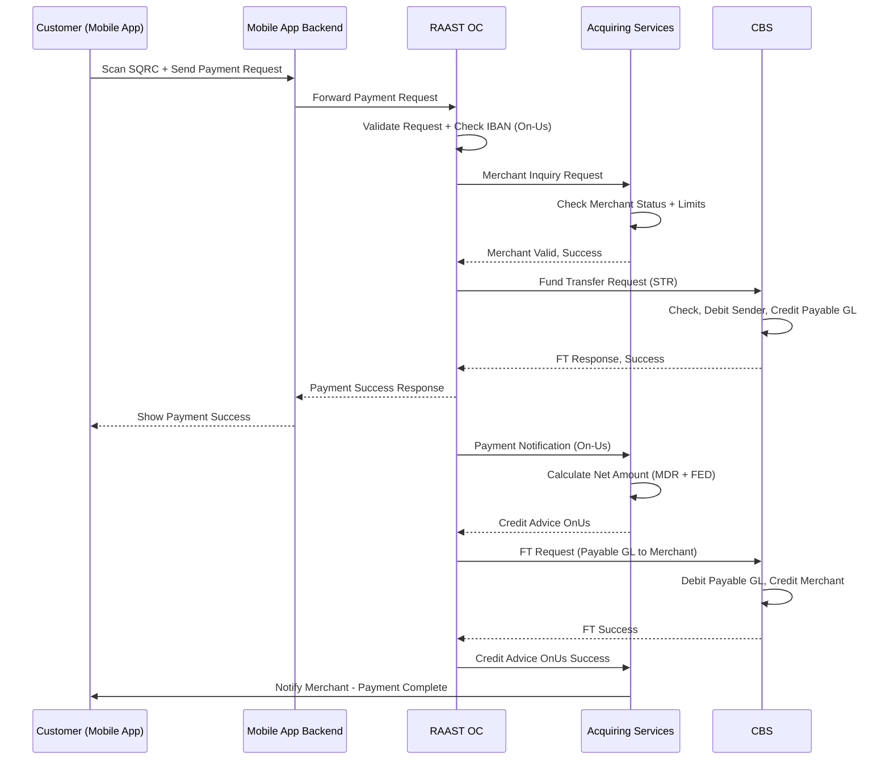
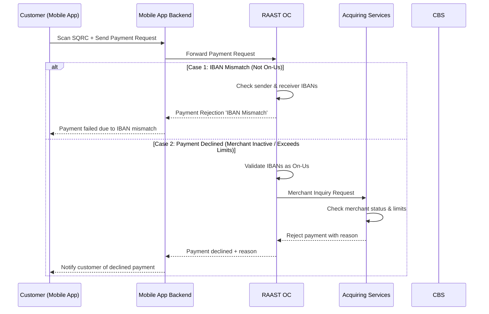

# Static QRC (SQRC) — On-Us Transaction

Static QRC is a customer-initiated push payment.

- RAAST provides the mechanism to generate a Static QR code (EMVCo standard).
- A Static QR can be paid more than once — it does not expire.
- Acquiring Services (RAAST) manages the Static QR lifecycle.
- Static QR can be scanned and paid by any Bank/EMI app that supports RAAST QR.
- The merchant account always resides with the Acquiring Bank (MSP Bank).

This is the flow when both Customer and Merchant hold accounts at the same Acquiring Bank.

## Positive Flow

| Requester | Action(s) / Process Description |
|---|---|
| Channel (Mobile App) | Customer scans Static QR and sends payment request. |
| Mobile App Backend | Backend services receive request and forward to RAAST OC. |
| RAAST OC | Performs validation on received request. Checks sender and receiver IBAN — identifies as On-Us (same BIC). Sends Merchant Inquiry request to Acquiring Services (RAAST). |
| Acquiring Services (RAAST) | Checks Merchant Status (Approved/Active). Checks Merchant Limits. Verifies Merchant account. Responds back to RAAST OC with success. |
| RAAST OC | Receives success from Acquiring Services. Initiates Fund Transfer request to CBS (STR Fund Transfer Deposits). |
| CBS | Checks sender limit and status. Debits sender (customer) account. Credits Merchant Payable GL Account. Responds back to RAAST OC with success. |
| RAAST OC | Receives success. Responds to channel with success. Initiates Payment Notification (On-Us) to Acquiring Services. |
| Acquiring Services | Receives Payment Notification. Responds with acknowledgement. Calculates net amount (MDR + FED deduction). Sends Credit Advice (On-Us) to RAAST OC. |
| RAAST OC | Receives Credit Advice. Initiates Fund Transfer to CBS (STR Fund Transfer Deposits). |
| CBS | Receives FT request. Debits Merchant Payable GL Account (total fee deducted from transaction amount). Credits Merchant Account (net amount). Responds to RAAST OC with success. |
| RAAST OC | Receives success. Sends Credit Advice On-Us success to Acquiring Services. |
| Acquiring Services | Notifies merchant of successful payment via in-app notification. |

### Sequence Diagram — SQRC On-Us (Positive)

## Negative Cases

### IBAN Mismatch — Customer / Merchant Not from Acquiring Bank

| Requester | Action(s) / Process Description |
|---|---|
| Channel (Mobile App) | Customer scans QR. Enters amount. Approves transaction. |
| Mobile App Services | Processes payment request. Sends to RAAST OC. |
| RAAST OC | Checks sender and receiver IBANs. Detects that one or both IBANs are not from Acquiring Bank. Returns payment rejection 'IBAN Mismatch' to Mobile App Services. |
| Mobile App Services | Notifies customer: 'Payment failed due to IBAN mismatch'. |

### Payment Declined — Merchant Account Inactive / Exceeds Limits

| Requester | Action(s) / Process Description |
|---|---|
| RAAST OC | IBANs validated as On-Us. Sends Merchant Inquiry to Acquiring Services. |
| Acquiring Services (RAAST) | Checks merchant account status. Merchant account is inactive or exceeds transaction limits. Rejects payment with reason. |
| RAAST OC | Returns payment declined to Mobile App Services with reason (e.g., 'Merchant Account Inactive' / 'Exceeds Transaction Limits'). |
| Mobile App Services | Notifies customer of declined payment with reason. |

### Sequence Diagram — SQRC On-Us (Negative)

