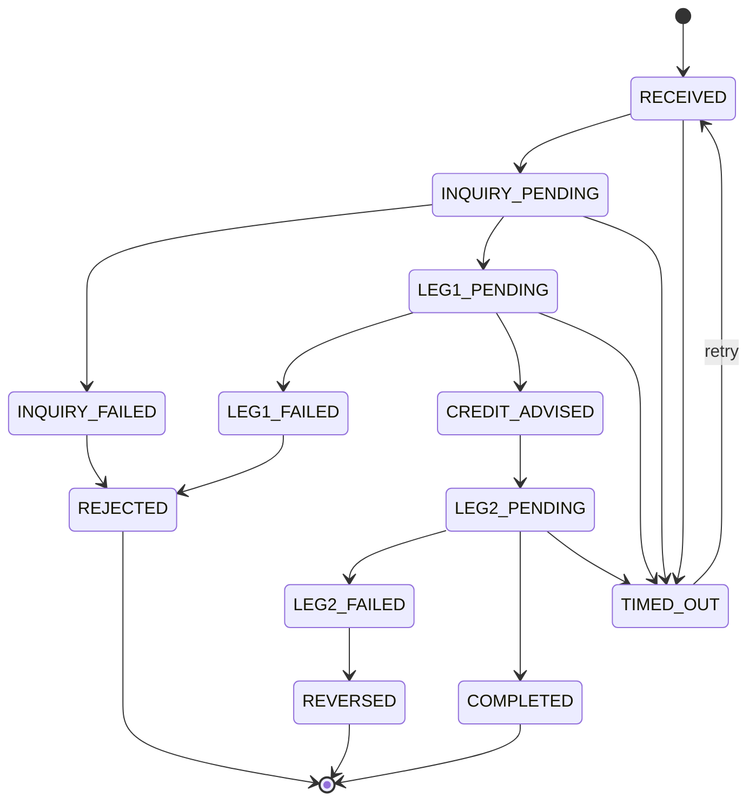

# Transaction Status Model

All transactions across use cases follow a common status lifecycle. Both Open Connect (OC) and MMS maintain synchronized status to ensure reconciliation consistency.

| Status | Description | Final? |
|---|---|---|
| RECEIVED | Payment instruction received by OC; processing not yet started | No |
| INQUIRY_PENDING | Merchant Status Inquiry dispatched to MMS; awaiting response | No |
| INQUIRY_FAILED | MMS returned non-ACTIVE status; rejection being prepared | No |
| LEG1_PENDING | CBS Leg 1 posting in progress | No |
| LEG1_FAILED | CBS Leg 1 failed; transaction to be rejected | No (leads to REJECTED) |
| CREDIT_ADVISED | Payment notification sent to MMS; MDR calculation in progress | No |
| LEG2_PENDING | CBS Leg 2 net credit posting in progress | No |
| LEG2_FAILED | CBS Leg 2 failed; exception raised; manual intervention required | No (exception) |
| COMPLETED | Both legs posted; merchant notified; payer confirmed; reconciliation ready | Yes |
| REJECTED | Transaction rejected – merchant inactive, CBS error, or RAAST NACK | Yes |
| TIMED_OUT | No response received within processing SLA; retry possible | No (retriable) |
| REVERSED | Leg 1 reversed due to Leg 2 failure or system error | Yes (exception) |

## Status Flow

Two Leg-1 / Leg-2 terminology used above maps to the two-leg settlement model described in [MDR & FED Calculation Detail](../Settlement/MDR-FED-Calculation): **Leg 1** debits the payer and credits the Merchant Payable GL Account (gross amount); **Leg 2** debits the Merchant Payable GL Account and credits the Merchant Account (net amount, after MDR + FED deduction).
